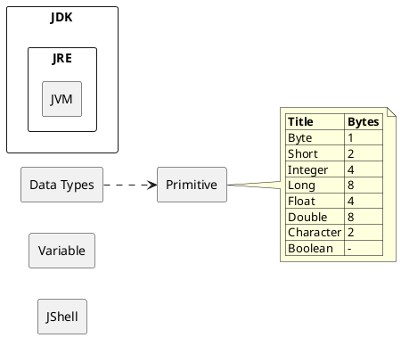

```plantuml
@startuml
!pragma teoz true
left to right direction
skinparam componentStyle rectangle

[JShell]

component "JDK" {
    component "JRE" {
        component "JVM"
    }
}

[Variable]

[Data Types]
[Data Types] ..> [Primitive]

note right of [Primitive]
|= Title |= Bytes |
| Byte | 1 |
| Short | 2 |
| Integer | 4 |
| Long | 8 |
| Float | 4 |
| Double | 8 |
| Character | 2 |
| Boolean | - |
end note
@enduml
```
