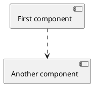
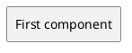
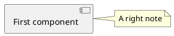
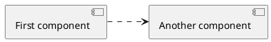
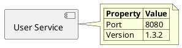
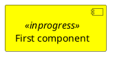
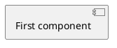

## Default diagram


```
@startuml
[First component] ..> [Another component]
@enduml
```

## Custom block style


```
@startuml
skinparam componentStyle rectangle
[First component]
@enduml
```

## Note


```
@startuml
[First component]
note right of [First component]: A right note
@enduml
```
## Custom block order


```
@startuml
left to right direction
[First component] ..> [Another component]
@enduml
```

## Table inside note

```
@startuml
!pragma teoz true

component "User Service" as US

note right of US
|= Property |= Value |
| Port | 8080 |
| Version | 1.3.2 |
end note
@enduml
```

## Custom block color


```
@startuml
skinparam component {
  BackgroundColor<<inprogress>> yellow
}
[First component] <<inprogress>>
@enduml
```

## Hide stereotype


```
@startuml
hide stereotype
[First component] <<inprogress>>
@enduml
```
