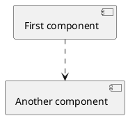
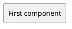
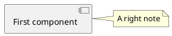
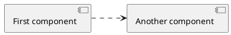

## Default diagram


```
@startuml
[First component] ..> [Another component]
@enduml
```

## Custom block style


```
@startuml
skinparam componentStyle rectangle
[First component]
@enduml
```

## Note


```
@startuml
[First component]
note right of [First component]: A right note
@enduml
```
## Custom block order


```
@startuml
left to right direction
[First component] ..> [Another component]
@enduml
```
